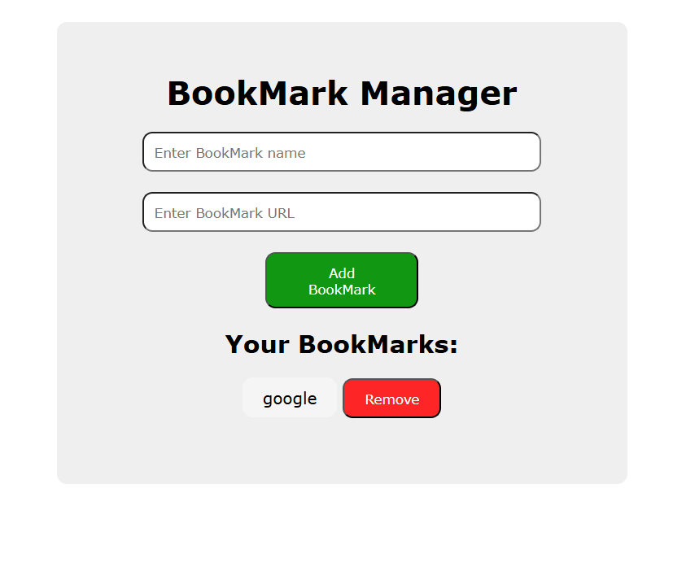

# Bookmark Manager

A simple, browser-based Bookmark Manager built using HTML, CSS, and JavaScript. It allows users to add, view, and remove website bookmarks with data persisted using `localStorage`.

# Summary

This marks my second repo
- I created this using HTML, CSS AND JAVASCRIPT.
- The learning from this project is about the working of localStorage in javaScript.
- Suggestion and contributions are most welcome.
- A small step towards building hopefully a good big project in the future.

# Deployment

https://ayeshasbookmarkmanager.netlify.app/

## Features

- Add bookmarks with name and URL
- Open bookmarks in a new tab
- Remove unwanted bookmarks
- Data persistence using browser `localStorage`
- Responsive and minimal UI

## Technologies Used

- HTML5
- CSS3
- Vanilla JavaScript (ES6)

## Screenshot

